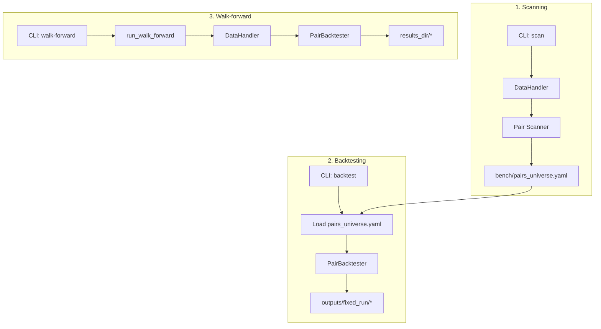

# Architecture

## Backtest timing

- Rolling statistics for bar `i` are computed from `[i - rolling_window, i - 1]` only.
- Signal generated on bar `i` is executed on bar `i + 1`; entry `z_score`/`beta` use the signal bar.
- Numba full engine follows the same 1-bar lag and entry-beta conventions for costs and PnL.
- Cost model is aggregated: `commission_pct + slippage_pct` are applied; `enable_realistic_costs` parameters are reserved and not wired into the core PnL path yet.
