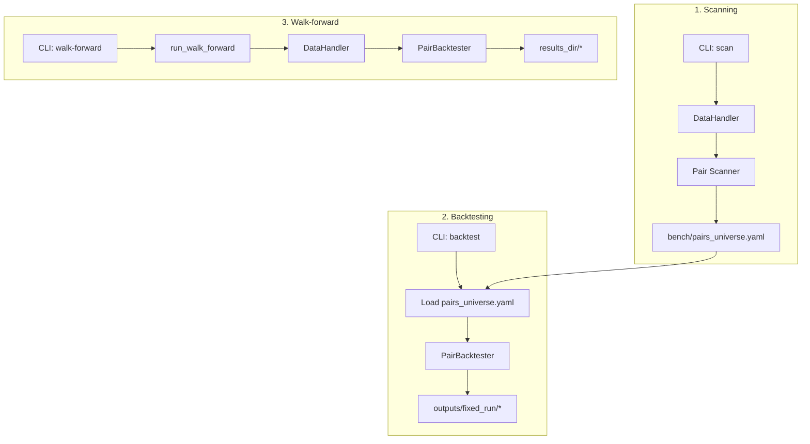

# Architecture

```mermaid
graph TD
    subgraph "1. Scanning"
        A[CLI: scan] --> B[DataHandler]
        B --> C[Pair Scanner]
        C --> D[bench/pairs_universe.yaml]
    end
    subgraph "2. Backtesting"
        E[CLI: backtest] --> F[Load pairs_universe.yaml]
        F --> G[PairBacktester]
        G --> H[outputs/fixed_run/*]
    end
    subgraph "3. Walk-forward"
        I[CLI: walk-forward] --> J[run_walk_forward]
        J --> K[DataHandler]
        K --> L[PairBacktester]
        L --> M[results_dir/*]
    end
    D --> F
```
